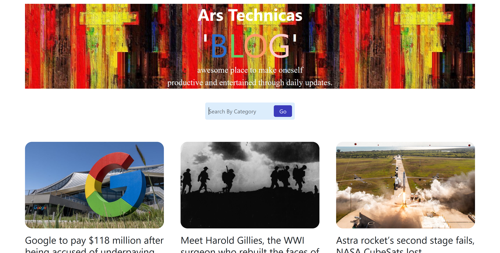

# My Static Blogging Web Application

# Description

My Static Blogging Web Application is a simple web-based blogging platform built using React. It allows users to read and explore various blog posts on different topics. The application is designed to be fast, responsive, and user-friendly, providing an enjoyable reading experience for visitors.

# Installation

## To run the My Static Blogging Web Application locally on your machine, follow these steps:

1. Prerequisites: Make sure you have Node.js and npm (Node Package Manager) installed on your system.

2. Clone the Repository: Clone this repository to your local machine
   git clone https://github.com/your-username/my-static-blog.git  (https://github.com/himanshu456ia/blog1.git)
   
3.Install Dependencies: Navigate to the project directory and install the required packages:
  cd blog1
  npm install

# Usage

Start the Development Server: After installing the dependencies, start the development server:
npm start

Access the Application: Open your web browser and go to http://localhost:3000/ to access the My Static Blogging Web Application.

